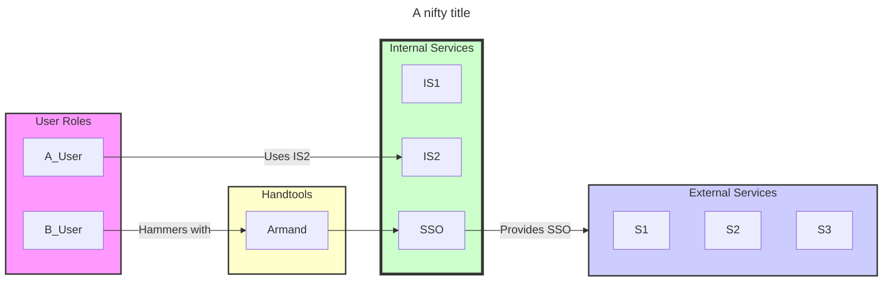

# ghp

This is GHP! Have an Octocat day.

```mermaid
---
title: A nifty title
---
flowchart LR
    subgraph User_Roles [User Roles]
        A_User
        B_User
    end

    subgraph External_Services [External Services]
        S1
        S2
        S3
    end

    subgraph Internal_Services [Internal Services ]
        IS1
        IS2
        SSO
    end

    subgraph Tools [Handtools]
        Hammer[Armand]
    end

    A_User --> |Uses IS2| IS2
    B_User --> |Hammers with| Hammer
    Hammer --> SSO

    SSO --> |Provides SSO| External_Services

    style User_Roles fill:#f9f,stroke:#333,stroke-width:2px
    style External_Services fill:#ccf,stroke:#333,stroke-width:2px
    style Internal_Services fill:#cfc,stroke:#333,stroke-width:4px
    style Tools fill:#ffc,stroke:#333,stroke-width:2px


```
